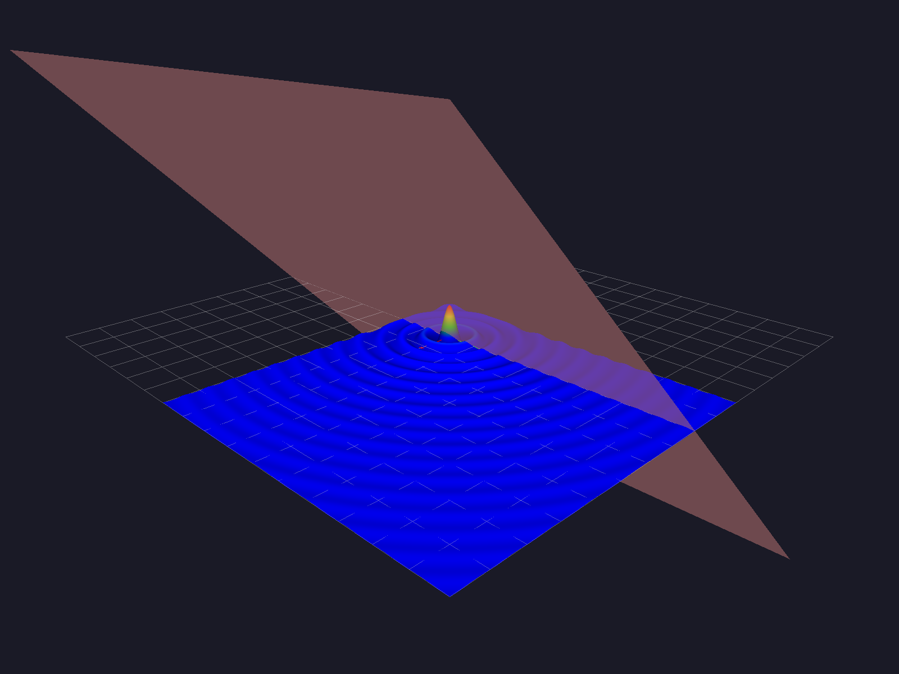
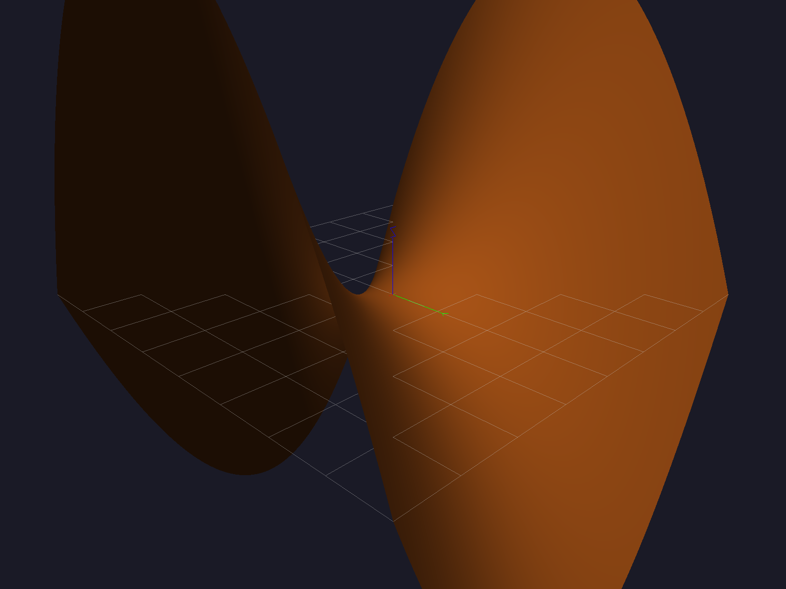
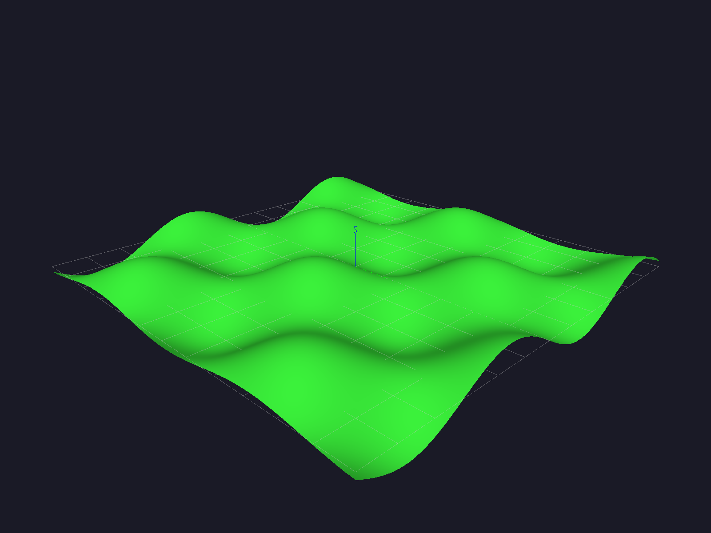

# Surfex

<p align="center">
  <a href="#overview">Overview</a> ·
  <a href="#requirements">Requirements</a> ·
  <a href="#architecture">Architecture</a> ·
  <a href="#workflow">Workflow</a> ·
  <a href="#usage">Usage</a> ·
  <a href="#controls">Controls</a> ·
  <a href="#clone-and-build">Clone and Build</a> ·
  <a href="#development">Development</a> ·
  <a href="#license">License</a>
</p>

Surfex is a small surface-plotting library for two-variable functions in Python.

It combines a Python-facing API with an OpenGL/C++ renderer for fast interactive inspection of mathematical surfaces.

Surfex uses a fixed `nx × ny` sampling grid, which keeps plotting predictable and fast for interactive use.

<p align="center">
  
  
  
</p>

## Overview

- Plots functions of two variables as 3D surfaces
- Supports multiple windows shown in sequence
- Supports solid color and heatmap rendering
- Includes orbit-style camera controls
- Uses a fixed `nx × ny` grid for surface generation
- Lets you set the grid with `sx.init(x_range, y_range, subdivisions)` (default `500`)
- Exposes a Python API for interactive use

## Requirements

- Python 3.10+
- CMake 3.20+
- A C++20 compiler
- OpenGL, GLFW, and libpng development packages
- `pybind11` in the same Python environment used for the build

## Architecture

- `src/` contains the native renderer and pybind11 bindings
- `src/glad.c`, `include/glad/`, and `include/KHR/` contain the vendored/generated OpenGL loader files
- `include/` contains the native headers
- `python/surfex/` contains the installable Python package
- `python/surfex/shaders/` contains runtime shader assets installed alongside the package and loaded relative to `surfex._core`
- The compiled extension is installed as `surfex/_core*.so`

## Workflow

Use this order when plotting:

1. Import Surfex.
2. Create a plot with `plot = sx.init(x_range, y_range, subdivisions)`.
3. Add one function or several functions to that plot with `plot.add(function, x_range, y_range, color, alpha)`.
4. Give each function its own range if needed.
5. Create more plots the same way if you want multiple figures.
6. Call `sx.show()` at the end.

Notes:
- `subdivisions` sets both the X and Y grid size.
- Multiple plots are shown one after another.
- One plot can contain one function or many functions.

## Usage

```python
import math as m
import surfex as sx

def ripple(x, y):
    r = (100 * x * x + 100 * y * y) ** 0.5
    if r == 0.0:
        return 1.0
    return m.sin(r) / r

def f(x, y):
    return x

def saddle(x, y):
    return 0.35 * (x * x - y * y)


def wave(x, y):
    return 0.6 * m.sin(x) * m.cos(y)


if __name__ == "__main__":
    plot1 = sx.init([-8.0, 8.0], [-8.0, 8.0], 500)
    plot1.add(ripple, [-2.0, 8.0], [-2.0, 8.0], color="heatmap", alpha=1.0)
    plot1.add(f, [-8.0, 8.0], [-8.0, 8.0], color="red", alpha=0.4)

    plot2 = sx.init([-4.0, 4.0], [-4.0, 4.0], 500)
    plot2.add(saddle, color="saddlebrown", alpha=1.0)

    plot3 = sx.init([-6.0, 6.0], [-6.0, 6.0], 500)
    plot3.add(wave, color="limegreen", alpha=1.0)

    sx.show()
```

## Controls

- `H` / `Left Arrow`: rotate left
- `L` / `Right Arrow`: rotate right
- `J` / `Down Arrow`: tilt down
- `K` / `Up Arrow`: tilt up
- `W`: zoom in
- `S`: zoom out
- `X`, `Y`, `Z`: snap toward standard views with a short animation
- `P`: save a PNG screenshot to `screenshots/`
- `Q`: close the current window


## Clone and Build

Surfex is installed from source with CMake. CMake uses the Python interpreter you pass in `Python_EXECUTABLE` to locate headers, pybind11, and the correct `site-packages` directory.

### macOS

Install the native dependencies first.

#### Dependencies

```bash
brew install cmake glfw libpng pybind11
```

Clone the repository with HTTPS or SSH.

#### HTTPS

```bash
git clone https://github.com/milleeklof/surfex.git
cd surfex
```

#### SSH

```bash
git clone git@github.com:milleeklof/surfex.git
cd surfex
```

Create and activate a Python environment, then install `pybind11` into it.

#### Python

```bash
python3 -m venv .venv
source .venv/bin/activate
python -m pip install -U pip pybind11
```

Configure, build, and install Surfex into that environment.

#### Build

```bash
cmake -S . -B build -DCMAKE_BUILD_TYPE=Release -DPython_EXECUTABLE="$(which python)"
cmake --build build
cmake --install build
```

### Linux

Install `cmake`, `glfw`, and `libpng` with your package manager if they are not already present.

Clone the repository with HTTPS or SSH.

#### HTTPS

```bash
git clone https://github.com/milleeklof/surfex.git
cd surfex
```

#### SSH

```bash
git clone git@github.com:milleeklof/surfex.git
cd surfex
```

Create and activate a Python environment, then install `pybind11` into it.

#### Python

```bash
python3 -m venv .venv
source .venv/bin/activate
python -m pip install -U pip pybind11
```

Configure, build, and install Surfex into that environment.

#### Build

```bash
cmake -S . -B build -DCMAKE_BUILD_TYPE=Release -DPython_EXECUTABLE="$(which python)"
cmake --build build
cmake --install build
```

After installation, this should work without `PYTHONPATH`:

```python
import surfex
```

## Development

- Use `cmake -S . -B build -DPython_EXECUTABLE="$(which python)"` to configure against the active environment
- Use `cmake --build build` for incremental builds
- Use `cmake --install build` to install into the selected Python environment
- Run `python scripts/check_surfex_install.py` to see which Python interpreters on your PATH can import Surfex
- Optional developer toggles are `-DSURFEX_ENABLE_WARNINGS=ON` and `-DSURFEX_ENABLE_SANITIZERS=ON` with a Debug build
- The example script can be run after install with `python examples/example.py`

## License

Surfex is licensed under BSD-3-Clause: permissive, low-friction, and friendly to both open and closed downstream use.

Third-party notices for the vendored/generated GLAD and Khronos files are in `THIRD_PARTY_NOTICES.md`, with license texts in `LICENSES/`.
