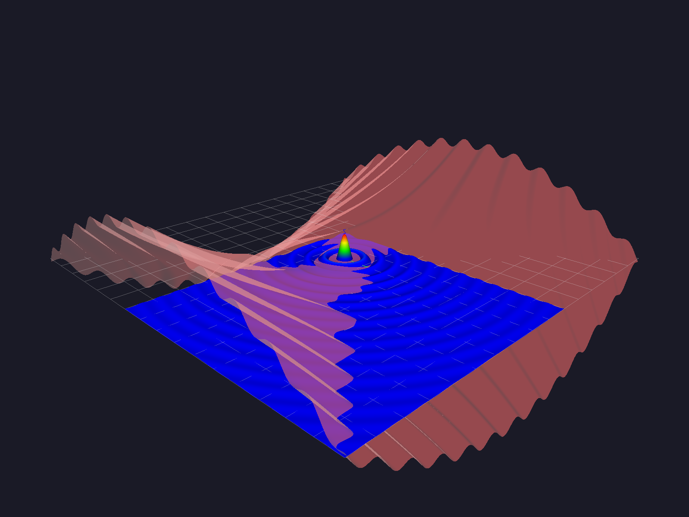
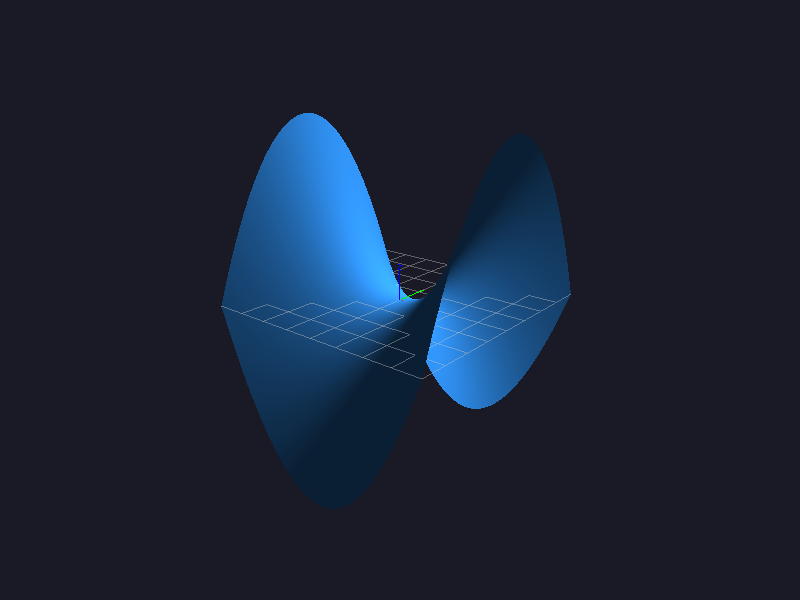

# Surfex

<p align="center">
  <a href="#overview">Overview</a> ·
  <a href="#requirements">Requirements</a> ·
  <a href="#architecture">Architecture</a> ·
  <a href="#workflow">Workflow</a> ·
  <a href="#example">Example</a> ·
  <a href="#controls">Controls</a> ·
  <a href="#clone-and-build">Clone and Build</a> ·
  <a href="#verify">Verify</a> ·
  <a href="#license">License</a>
</p>

Surfex is a small surface-plotting library for two-variable functions in Python.

It combines a Python-facing API with an OpenGL/C++ renderer for fast interactive inspection of mathematical surfaces.


<p align="center">
  
  
  
</p>

## Overview

- Plots functions of two variables as 3D surfaces
- Supports multiple windows shown in sequence
- Supports solid color and heatmap rendering
- Includes orbit-style camera controls
- Uses a fixed `nx × ny` grid for surface generation
- Lets you set the grid with `sx.init(x_range, y_range, subdivisions)` (default `500`)
- Exposes a Python API for interactive use

## Requirements

- Python 3.10+
- CMake 3.20+
- A C++20 compiler available on your system `PATH`
- OpenGL, GLFW, GLM, and libpng development packages
- `pybind11` is managed automatically by the installer

## Architecture

- `src/` contains the native renderer and pybind11 bindings
- `src/glad.c`, `include/glad/`, and `include/KHR/` contain the vendored/generated OpenGL loader files
- `include/` contains the native headers
- `python/surfex/` contains the installable Python package
- `python/surfex/shaders/` contains runtime shader assets installed alongside the package and loaded relative to `surfex._core`
- The compiled extension is installed as `surfex/_core*.so`

## Workflow

Use this order when plotting:

1. Import Surfex.
2. Create a plot with `plot = sx.init(x_range, y_range, subdivisions)`.
3. Add one function or several functions to that plot with `plot.add(function, x_range, y_range, color, alpha)`. If no ranges for x and y are given, it will use the same as x_range and y_range for the plot.
4. Give each function its own range if needed.
5. Create more plots the same way if you want multiple figures.
6. Call `sx.show()` at the end.

Notes:
- `subdivisions` sets both the X and Y grid size.
- Multiple plots are shown one after another.
- One plot can contain one function or many functions.

## Example

```python
import math as m
import surfex as sx

def ripple(x, y):
    r = (100 * x * x + 100 * y * y) ** 0.5
    if r == 0.0:
        return 1.0
    return m.sin(r) / r

def twist(x, y):
    return 0.2 * m.sin(0.6 * x * y) + 0.05 * (x * x - y * y)

def sincy(x, y):
    r = (100*x*x + 100*y*y)**0.5
    if r == 0:
        r = 1
    return 2*m.sin(r)/r * x*y

def wave(x, y):
    return 0.6 * m.sin(x) * m.cos(y)


if __name__ == "__main__":
    plot1 = sx.init([-8.0, 8.0], [-8.0, 8.0], 500)
    plot1.add(ripple, [-2.0, 8.0], [-2.0, 8.0], color="heatmap", alpha=1.0)
    plot1.add(twist, [-8.0, 8.0], [-8.0, 8.0], color="red", alpha=0.4)

    plot2 = sx.init([-4.0, 4.0], [-4.0, 4.0], 500)
    plot2.add(sincy, color="heatmap", alpha=1.0)

    plot3 = sx.init([-6.0, 6.0], [-6.0, 6.0], 500)
    plot3.add(wave, color="limegreen", alpha=1.0)

    sx.show()
```

- The example script can be run after install with `python examples/test.py`

## Controls

- `H` / `Left Arrow`: rotate left
- `L` / `Right Arrow`: rotate right
- `J` / `Down Arrow`: tilt down
- `K` / `Up Arrow`: tilt up
- `W`: zoom in
- `S`: zoom out
- `X`, `Y`, `Z`: snap toward standard views with a short animation
- `P`: save a PNG screenshot to `captures/`
- `Q`: close the current window


## Clone and Build

Surfex is distributed as source code and must be built locally.

### Requirements

Surfex requires:

* A C++20 compiler (`clang++` or `g++`)
* CMake ≥ 3.20
* Python
* GLFW
* libpng

---

### macOS

Install Apple's command line tools:

```bash
xcode-select --install
```

Install the required dependencies:

```bash
brew install cmake glfw glm libpng
```

---

### Linux

Install a C++20 compiler and the required dependencies.

On Ubuntu/Debian:

```bash
sudo apt install \
    build-essential \
    cmake \
    libgl1-mesa-dev \
    libglfw3-dev \
    libglm-dev \
    libpng-dev \
    python3-dev \
    python3-pip \
    python3-venv
```

---

### Installation (recommended)

Install Surfex by cloning the repository and running the installer:

```bash
git clone https://github.com/milleeklof/surfex.git
cd surfex
./install.sh
```

`./install.sh` will:

1. Discover Python installations.
2. Show each interpreter’s path, Python version, and whether Surfex is already installed.
3. Mark Python versions below 3.10 as unsupported.
4. Let you choose one interpreter.
5. Install `pybind11` automatically if it is missing.
6. Check whether the selected interpreter can write to its install location.
7. Offer a local `.venv` fallback when needed.
8. If the install location is not writable, offer another interpreter, a local `.venv`, sudo, or cancel.
9. Build and install Surfex.
10. Let you quit at any prompt with `Q`, `q`, or `quit`.

If the selected Python is externally managed, the installer may offer a `.venv` fallback or a force-install option.

Advanced override: show system Python interpreters too.

```bash
SURFEX_SHOW_SYSTEM_PYTHON=1 ./install.sh
```

After installation, `import surfex` should work from the interpreter you selected.

### Uninstallation

To remove Surfex from a selected interpreter:

```bash
./uninstall.sh
```

`./uninstall.sh` will:

1. Use the same interpreter-selection workflow as the installer.
2. Let you quit at any prompt with `Q`, `q`, or `quit`.
3. Remove only the Surfex package directory from the selected interpreter.
4. Leave `pybind11` and all other Python packages untouched.

By default, system Python interpreters such as `/usr/bin/python3` are hidden when better options exist. Use `SURFEX_SHOW_SYSTEM_PYTHON=1 ./install.sh` or `SURFEX_SHOW_SYSTEM_PYTHON=1 ./uninstall.sh` to reveal them when needed.


## Verify

After building and installing, you can check two things:

Verify the installation using the same Python interpreter or environment that you selected during installation.

For example, if you installed Surfex into a Conda environment, activate that environment before testing.
If you installed Surfex into a virtual environment, activate that virtual environment before testing.

1. Which Python environment has Surfex installed:

```bash
python tests/check_surfex_install.py
```

2. Whether the basic Python API smoke test passes:

```bash
python -m unittest discover -s tests
```

3. Run the example file:
```bash
python examples/test.py
```
## License

Surfex is licensed under BSD-3-Clause.

Third-party notices for the vendored/generated GLAD and Khronos files are in `THIRD_PARTY_NOTICES.md`, with license texts in `LICENSES/`.
